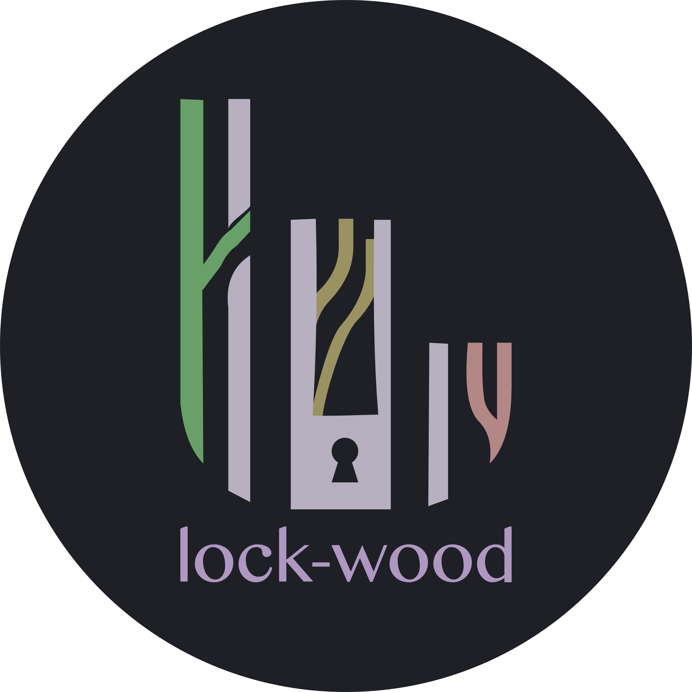

# lock-wood colour scheme

  

lock-wood is a cross-platform dark colour scheme for Neovim, terminal emulators,
web applications, documentation, and developer tooling. It is built around a
charcoal foundation and a deliberately muted syntax palette: dusty rose, sage
green, soft ochre, slate blue, mauve, muted cyan, and lavender-grey.

lock-wood is designed to feel familiar immediately and comfortable over time:
dark enough for focused work, colourful enough to distinguish code, and
restrained enough to stay out of the way.

## Motivation

lock-wood began as the colour scheme for a project I’m developing,
[lockORG](https://lockorg.com). During development, I realised that the palette
would work just as well beyond the application itself—particularly in the
terminal, where I spend much of my time using tools such as
[Neovim](https://neovim.io/) and [Lazygit](https://lazygit.dev/).

So it happened.

## Design character

- **Dark and calm:** near-black charcoal backgrounds reduce visual noise.
- **Muted and balanced:** accents are softened with grey, giving the theme a
  cohesive, low-fatigue appearance.
- **Cool-neutral foundation:** blue-grey and violet-grey UI tones support both
  warm and cool syntax colours.
- **Woodland influence:** sage, ochre, rose, and slate tones give lock-wood an
  organic character.
- **Portable by design:** the palette can map cleanly to terminal ANSI colours,
  editor highlights, CSS variables, and application design tokens.

## Palette

| Token            | HEX       | RGB           |
| ---------------- | --------- | ------------- |
| `bg-primary`     | `#1A1C20` | `26 28 32`    |
| `bg-secondary`   | `#242832` | `36 40 50`    |
| `text-border`    | `#484453` | `72 68 83`    |
| `black-dark`     | `#4E505B` | `78 80 91`    |
| `red-dark`       | `#C08281` | `192 130 129` |
| `green-dark`     | `#759C75` | `117 156 117` |
| `yellow-dark`    | `#AA9980` | `170 153 128` |
| `blue-dark`      | `#254A65` | `37 74 101`   |
| `magenta-dark`   | `#AE85AB` | `174 133 171` |
| `cyan-dark`      | `#699B98` | `105 155 152` |
| `white-dark`     | `#B6B2C6` | `182 178 198` |
| `black-bright`   | `#504C5E` | `80 76 94`    |
| `red-bright`     | `#B48787` | `180 135 135` |
| `green-bright`   | `#699F68` | `105 159 104` |
| `yellow-bright`  | `#9B9361` | `155 147 97`  |
| `blue-bright`    | `#587B98` | `88 123 152`  |
| `magenta-bright` | `#AF98C1` | `175 152 193` |
| `cyan-bright`    | `#6B9B97` | `107 155 151` |
| `white-bright`   | `#B7B2C1` | `183 178 193` |

## Suggested semantic mapping

The exact mapping can vary by implementation, but the palette naturally supports
these roles:

| Role                                          | Suggested colour                   |
| --------------------------------------------- | ---------------------------------- |
| Background                                    | `bg-primary`                       |
| Elevated surfaces                             | `bg-secondary`                     |
| Borders and separators                        | `text-border`                      |
| Comments and subdued text                     | `black-dark` or `black-bright`     |
| Errors and destructive states                 | `red-dark` or `red-bright`         |
| Success, strings, additions                   | `green-dark` or `green-bright`     |
| Warnings and constants                        | `yellow-dark` or `yellow-bright`   |
| Links, functions, information                 | `blue-bright`                      |
| Keywords and special syntax                   | `magenta-dark` or `magenta-bright` |
| Types, tags, operators, secondary information | `cyan-dark` or `cyan-bright`       |
| Primary foreground                            | `white-dark` or `white-bright`     |

## Ports

1. Applications
   - [btop](./applications/btop/README.md)
   - [neovim](https://github.com/lock-wood/neovim)

2. Terminals
   - [kitty](./terminals/kitty/README.md)
