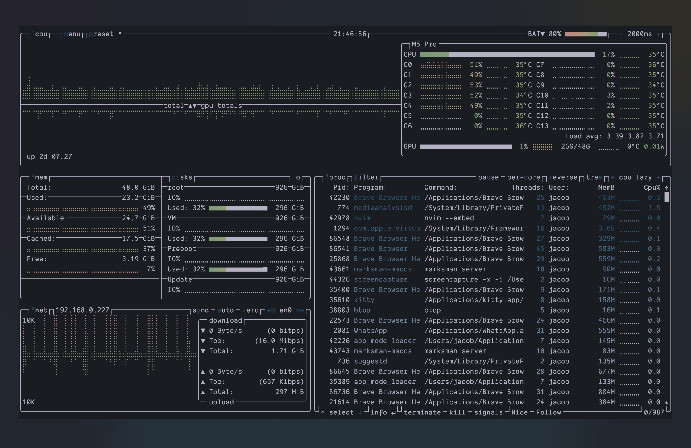

# btop

Please refer to the
[official documentation](https://github.com/aristocratos/btop#themes) to
determine where your `themes` folder is located for your platform.

Then, place `themes/lock-wood.theme` in that folder and restart the application.

  

