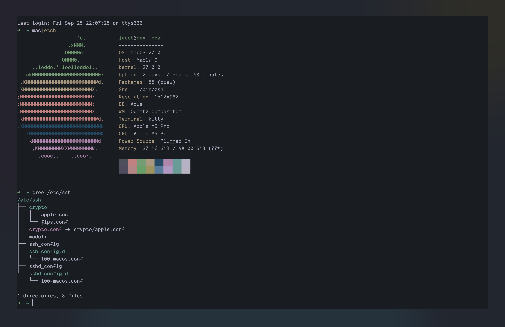

# Kitty

Place the `themes/lock-wood.conf` file in `$HOME/.config/kitty/themes/`.

Then, open `$HOME/.config/kitty/kitty.conf` and add the following line at the
top:

```
include themes/lock-wood.conf
```

Save the file and restart Kitty.

<p align="center">
  
</p>
